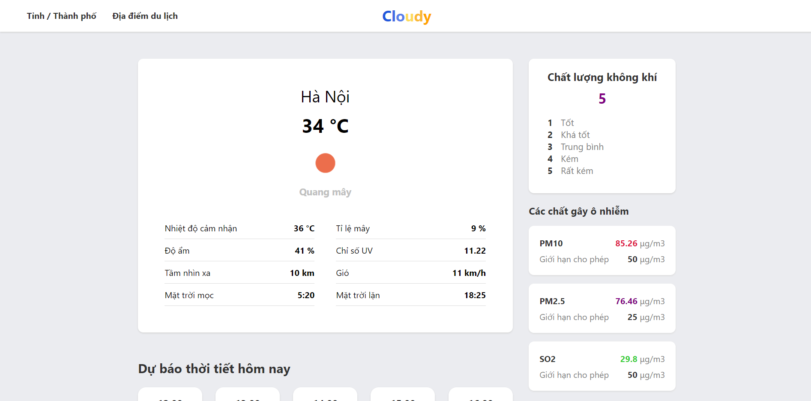

# Cloudy

Cloudy is a weather forecast application for Vietnam's territory.

## Usage

You can view the live demo of the application [here](https://minhthinh190.github.io/cloudy/).

   

   <em>App screenshot</em>

## Features

- Real-time local weather
- Hourly local weather forecasts
- Daily local weather forecasts for 5 days
- Real-time & Forecast weather of famous travel locations
- Real-time local air pollution data
- Detail data of key air pollutants

## Built With

- [React](https://reactjs.org/)
- [OpenWeather API](https://openweathermap.org/api)